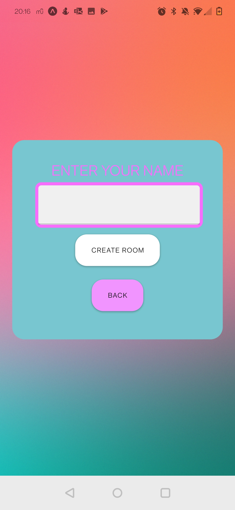

# ScrewIt

ScrewIt! is a mobile party game application for iOS and Android for fun on the go!

   
   
   

   
   
    

## Frameworks Powering ScrewIt!

- [React Native](https://facebook.github.io/react-native/)
  Cross-platform app development framework
- [Expo](https://expo.io)
  Developer tool for making universal native apps that run on multiple platforms
- [Socket.io](https://socket.io/)
  Bidirectional and low-latency communication
- [AWS Amplify](https://docs.amplify.aws/)
  User Authentication and Managment
- [Node.Js](https://nodejs.org/api/)
  Backend Management
- [Express](https://expressjs.com/en/5x/api.html)
  Middleware

## How to Build

- Clone Repo
- NPM install
- NPM Start
- Navigate to the Server Folder / Directory and input commad: node server.js to start server.
- NOTE - There were many issues with packages and dependincies not installing correctly. There is a change you may have to manually install certain packages.
